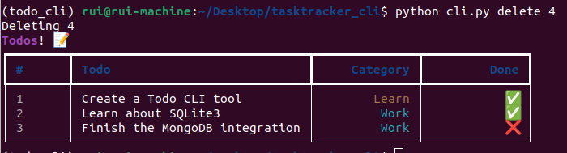

# A simple CLI Todo List

This Task Tracker CLI tool was built entirely in python with the help of rich and typer. It has an SQLite3 integration to store all the data.

This tool also comprises 5 main features:

<ul>
<li> <b>Add</b> a new task </li>
</ul>

<ul>
<li> <b>Update</b> a new task </li>
</ul>

<ul>
<li> <b>Complete</b> a task </li>
</ul>

<ul>
<li> <b>Show</b> all task </li>
</ul>

<ul>
<li> <b>Delete</b> a task </li>
</ul>

